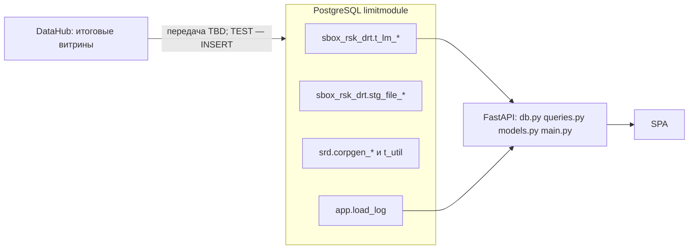

# Переход прототипа на PostgreSQL-копию итоговых витрин DataHub

Актуально для `Limit_module/` после этапов 1–13 плана перехода.
Типы колонок и единственное отклонение имён (GAP G11) — в [ddl_conversion.md](ddl_conversion.md).

## Что было

Прототип держал **изобретённую** схему в `public`: `companies`, `company_groups`,
`group_sublimits`, `limits`, `sublimits`, `limit_applications`, `reserves` /
`reserve_positions`, `financial_indicators`, `company_sync_log`. Ключ клиента —
суррогатный `companies.id`. Суммы считались в API (`limit − used`, `SUM` по блокам).
Фронтенд ходил на `/api/companies/{id}/*`, имел вкладки «Финансовая отчётность» и
«События» (нет в БТ) и fallback на `demo-data.js`.

ER прототипа и TO-BE (картинки Graphviz) лежат **вне этого git** — соседний каталог `context/data/` рабочего дерева. В репозитории модуля: [specs/current.md](../specs/current.md).

## Что изменилось

- В PostgreSQL `limitmodule` лежат **копии** 13 таблиц DataHub (схемы `sbox_rsk_drt`, `srd`)
  плюс одна техническая таблица `app.load_log`.
- Backend читает витрины **напрямую** (`t_lm_1_2_clients`, `t_lm_1_2_gk_info`,
  `t_lm_1_3_limits`, `t_lm_egar_limits`). VIEW, read-model и ORM нет.
- Ключ клиента — ИНН; ключ ГК — `group_crm_id1` / `gk_crm_id`.
- Поля, которых нет в DDL источника, **не создаются** (MISSING в UI как «—» / «нет в витрине»).
- Удалены: `db/01–06`, старые endpoints, `ensure_schema`, `refresh_companies.py`,
  `demo-data.js`, `events.js`.

## Как теперь устроено

`search_path = REPLICA_SCHEMA,app,public` (env `REPLICA_SCHEMA`, по умолчанию `sbox_rsk_drt`).
SQL в `queries.py` без схемы в именах таблиц. `Decimal` уходит в JSON строкой.

## Таблицы-копии DataHub

13 таблиц, 216 колонок, 1:1 с `context/data/ddl` (кроме GAP G11).
Без PK / FK / NOT NULL / DEFAULT / индексов.

| Таблица | Колонок | Читает UI |
|---|---|---|
| `sbox_rsk_drt.t_lm_1_2_clients` | 8 | да |
| `sbox_rsk_drt.t_lm_1_2_gk_info` | 10 | да |
| `sbox_rsk_drt.t_lm_1_3_limits` | 19 | да |
| `sbox_rsk_drt.t_lm_egar_limits` | 19 | да (`comment_egar`) |
| `sbox_rsk_drt.stg_file_*` (4) | 11+5+8+3 | нет |
| `srd.corpgen_*` (4) + `sbox_rsk_drt.t_util` | 40+24+28+16+25 | нет |

Логические связи (не FK): `uparty_inn_code = party_inn = inn`,
`group_crm_id1 = gk_crm_id`, `t_lm_egar_limits.id::text = t_lm_1_3_limits.limit_id`.

## Технические таблицы

Только `app.load_log(id, table_name, loaded_at, data_date, row_count, note)`.
Нужна для БТ 2.2 / 2.5.3 (дата обновления и предупреждение >24 ч).
На TEST строку пишет сервис `migrate` (`python -m app.seed_local`) после Alembic.

## Изменения кода по файлам

| Файл | Было | Стало | Зачем |
|---|---|---|---|
| `db/local/00,10–12,90,91_*.sql` | не было | снимок витрин + фикстуры | локальный initdb |
| `api/alembic` | не было | `app.load_log` | схема приложения |
| `db/01–06_*.sql` | схема прототипа | удалены | не DataHub |
| `api/app/db.py` | пул в `main.py` | пул + `search_path` | одно подключение |
| `api/app/queries.py` | SQL в `main.py` | константы и функции | параметризованный SQL |
| `api/app/models.py` | не было | Pydantic, Money=str | точность NUMERIC |
| `api/app/main.py` | `/companies/{id}` | `/clients`, `/groups/{crm_id}` | ключ ИНН |
| `web/js/api.js` | `/companies` + fallback | `/clients`, `/groups` | маппинг полей |
| `web/js/tab-tree.js` | id, события, отчётность | inn, заглушки сублимитов/резервов | состав БТ |
| `web/js/table-views.js` | ₽, суммы в JS | валюта строки, rest_lim из витрины | не пересчитывать |
| `web/js/format.js` | `new Date`, всегда ₽ | ISO-дата, `money(v, currency)` | зона и валюта |
| Helm ConfigMap | GROUPS/LIMITS/RESERVES_SQL | `REPLICA_SCHEMA` | нет ensure_schema |

## UI → DB Mapping

Полная таблица — в плане перехода (раздел Field mapping). Кратко:

- Поиск / карточка → `t_lm_1_2_clients` (`DISTINCT ON` / `LIMIT 1`, предпочтение `source=datahub`).
- ГК клиента → `t_lm_1_2_gk_info.party_inn`, fallback `t_lm_1_3_limits.gk_*`.
- Карточка ГК → `MAX` колонок «… на гк», `SUM` колонок «… по клиенту», `GROUP BY currency`.
- Лимиты / заявки → `t_lm_1_3_limits` (заявки: `limit_status LIKE 'На рассмотрении%'`);
  комментарий ИБ — `LEFT JOIN LATERAL t_lm_egar_limits`.
- Единый сублимит клиента → `t_lm_1_2_gk_info` по `party_inn`, не `SUM(lim_value)`.
- Актуальность → `app.load_log`.

## ER AS-IS / TO-BE

Картинки схем **не входят в этот репозиторий** (служебные файлы в `context/data/` рядом с модулем). Смысл:

- зелёные `t_lm_*` — копии витрин, их читает интерфейс;
- серые `stg_file_*` / `srd.*` / `t_util` — тот же сервер БД, UI не ходит;
- жёлтая `app.load_log` — таблица приложения (дата обновления копии).

Промежуточного слоя между DataHub и таблицами PostgreSQL нет. Сборка зелёных из серых на стороне приложения **пока не реализована** (витрины на TEST — моки).

## Test Data

| Класс | Таблицы | Источник |
|---|---|---|
| READY | `stg_file_client_limit` 897, `stg_file_egar_clients` 375, `stg_file_group_limit` 368 | `tools/convert_ref_inserts.py` → `db/local/90_test_refs.sql` |
| PARTIAL / моки | `t_lm_1_2_clients`, `t_lm_1_2_gk_info`, `t_lm_1_3_limits`, 3 строки `t_lm_egar_limits` | `db/local/91_test_marts.sql` |
| EMPTY | `stg_file_raroc`, `t_util`, 4 `srd.*` | не мокаются |

Сценарии S01–S14 перечислены в шапке `91_test_marts.sql`.

## Known gaps

См. `docs/ddl_conversion.md` §5 и план (GAP по экранам). Главное:

- нет в DDL: № договора, дата решения, комментарий КБ, PD, RWA, резервы, транши на дату, расшифровка ОКВЭД, «крышка» ГК;
- G11: имя `утилизированный совокупный лимит на гк` укорочено до `утилиз-й совокупный лимит на гк` (лимит 63 байта PostgreSQL);
- актуальность только через `app.load_log`;
- единицы совокупного лимита ГК и CHAR-пробелы в выгрузках — вопрос команде данных.

## Индексы (этап 13)

На тестовом объёме `EXPLAIN ANALYZE` (2026-09-27, чистая TEST БД):

| Запрос | План | Execution Time |
|---|---|---|
| поиск `ILIKE '%рост%'` + `DISTINCT ON` | Seq Scan, 15 строк | 0.26 мс |
| карточка `uparty_inn_code = …` | Seq Scan | 0.03 мс |
| лимиты `inn = 7702070139` (32 строки) | Seq Scan | 0.21 мс |
| сводка ГК `group_crm_id1 = 1-T15NKU4` | Seq Scan + GroupAggregate | 0.13 мс |

Индексы **не созданы** — seq scan укладывается в НФТ с запасом. Кандидаты
при росте копии (`gin_trgm_ops` на имя, `text_pattern_ops` на ИНН, btree на
`t_lm_1_3_limits.inn`) появятся в `db/30_indexes.sql` только после измерения
на PROD-подобном объёме.
